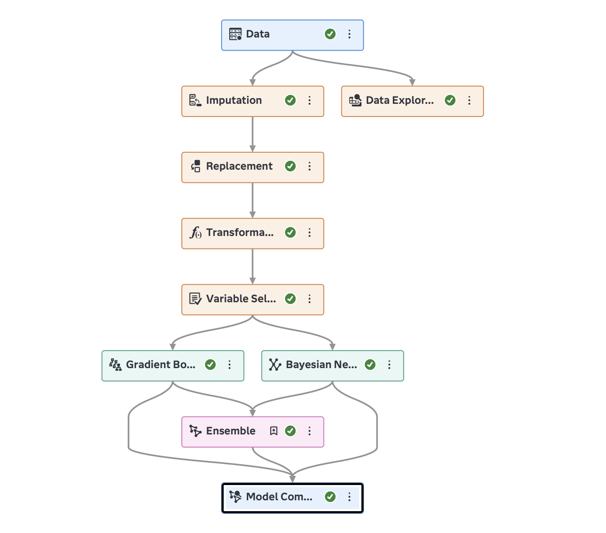
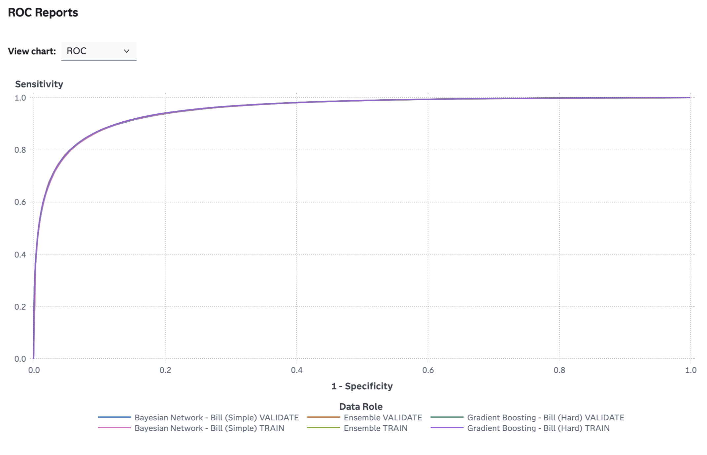

# Heart Disease Analytics using SAS Viya

## Project Overview

This project develops and evaluates machine learning models for heart disease prediction using SAS Viya. The workflow covers data preparation, feature engineering, model development, and model comparison to identify the most effective predictive approach.

## Objectives

* Predict the likelihood of heart disease using patient health data.
* Compare the performance of multiple machine learning models.
* Identify the best-performing model based on evaluation metrics.
* Demonstrate an end-to-end analytics workflow in SAS Viya.

## Tools and Technologies

* SAS Viya
* SAS Model Studio
* SAS Visual Analytics
* Machine Learning
* Predictive Analytics

## Workflow

### Data Preparation

* Missing value imputation
* Data replacement
* Data transformation

### Feature Engineering

* Variable selection

### Model Development

* Logistic Regression
* Bayesian Network
* Gradient Boosting
* Ensemble Model

### Model Evaluation

* Model Comparison
* ROC Analysis
* Accuracy Evaluation
* F1 Score Evaluation
* Lift and Gain Analysis

## Results

### Champion Model

**Ensemble Model**

### Performance Metrics

| Metric                 | Value  |
| ---------------------- | ------ |
| Accuracy               | 88.58% |
| Area Under ROC (AUC)   | 0.9544 |
| F1 Score               | 0.8837 |
| Misclassification Rate | 11.42% |

The Ensemble Model achieved the highest overall performance and was selected as the champion model.

## Repository Structure

```text
heart-disease-analytics-sas-viya/
│
├── README.md
├── screenshots/
│   ├── pipeline_workflow.png
│   ├── cumulative_lift_chart.png
│   ├── roc_curve.png
│   ├── accuracy_comparison.png
│   ├── gain_chart.png
│   └── f1_score_comparison.png
│
├── reports/
│   └── Model_Comparison_Results.pdf
│
└── data/
    └── Model_Comparison_formatted.csv
```
## Project Workflow




## ROC Curve



## Project Workflow


## Model Comparison


## ROC Curve


## Key Skills Demonstrated

* Data Cleaning
* Data Transformation
* Feature Engineering
* Predictive Modeling
* Machine Learning
* Model Evaluation
* Statistical Analysis
* Data Visualization

## Author

Bill Davidson

Bachelor of Computer Science (Data Analytics)
Asia Pacific University of Technology & Innovation (APU)
