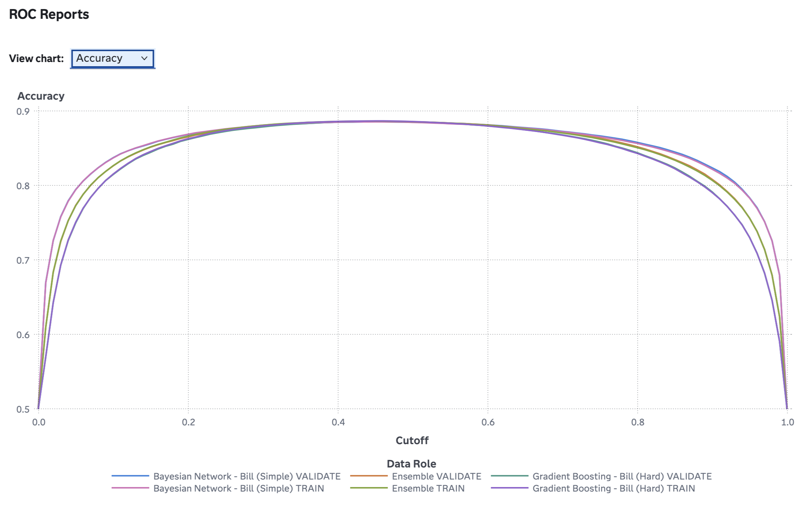
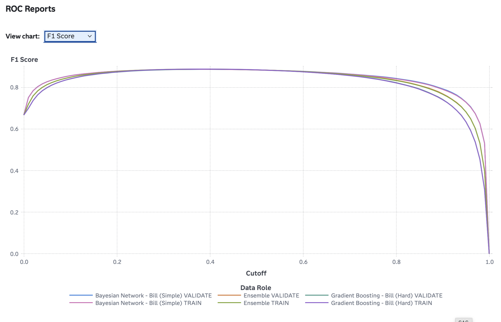
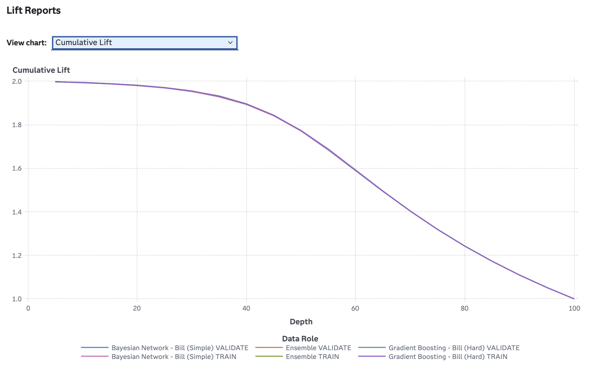
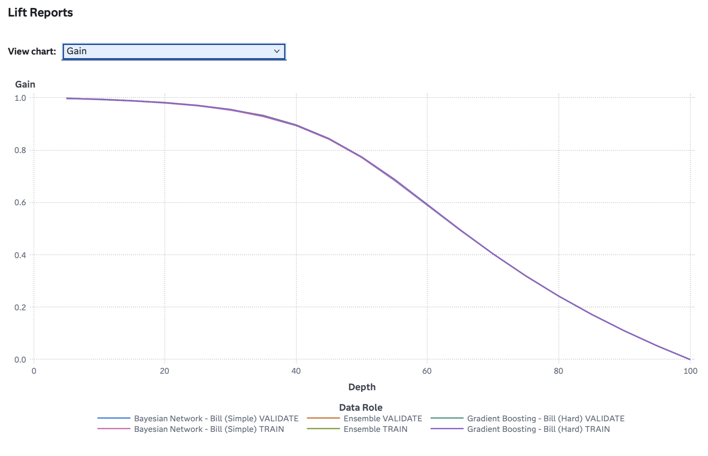

# Heart Disease Analytics using SAS Viya

## Project Overview

This project develops and evaluates machine learning models for heart disease prediction using SAS Viya. The workflow covers data preparation, feature engineering, model development, and model comparison to identify the most effective predictive approach.

## Objectives

- Predict the likelihood of heart disease using patient health data
- Compare multiple machine learning algorithms
- Identify the best-performing predictive model
- Demonstrate an end-to-end analytics workflow in SAS Viya

## Tools and Technologies

- SAS Viya
- SAS Model Studio
- SAS Visual Analytics
- Machine Learning
- Predictive Analytics

## Workflow

### Data Preparation
- Missing value imputation
- Data replacement
- Data transformation

### Feature Engineering
- Variable selection

### Model Development
- Logistic Regression
- Bayesian Network
- Gradient Boosting
- Ensemble Model

### Model Evaluation
- ROC Analysis
- Accuracy Evaluation
- F1 Score Evaluation
- Lift Analysis
- Gain Analysis
- Model Comparison

## Workflow Diagram


## ROC Curve


## Accuracy Comparison



## F1 Score Comparison



## Cumulative Lift Chart



## Gain Chart



## Results

### Champion Model
**Ensemble Model**

### Performance Metrics

| Metric | Value |
|----------|----------|
| Accuracy | 88.58% |
| Area Under ROC (AUC) | 0.9544 |
| F1 Score | 0.8837 |
| Misclassification Rate | 11.42% |

### Key Findings

- Ensemble learning achieved the best overall predictive performance.
- All evaluated models achieved strong classification performance with AUC values above 0.95.
- Feature engineering and preprocessing contributed significantly to model accuracy.
- The project demonstrates a complete machine learning workflow from data preparation through model evaluation.

## Repository Structure

```text
heart-disease-analytics-sas-viya/
│
├── README.md
├── screenshots/
│   ├── pipeline_workflow.png
│   ├── cumulative_lift_chart.png
│   ├── roc_curve.png
│   ├── accuracy_comparison.png
│   ├── gain_chart.png
│   └── f1_score_comparison.png
│
├── reports/
│   └── Model_Comparison_Results.pdf
│
└── data/
    └── Model_Comparison_formatted.csv
```

## Key Skills Demonstrated

- Data Cleaning
- Data Transformation
- Feature Engineering
- Machine Learning
- Predictive Analytics
- Statistical Analysis
- Model Evaluation
- Data Visualization
- SAS Viya

## Author

**Bill Davidson**

Bachelor of Computer Science (Data Analytics)  
Asia Pacific University of Technology & Innovation (APU)

## Contact

GitHub: https://github.com/B1LLD